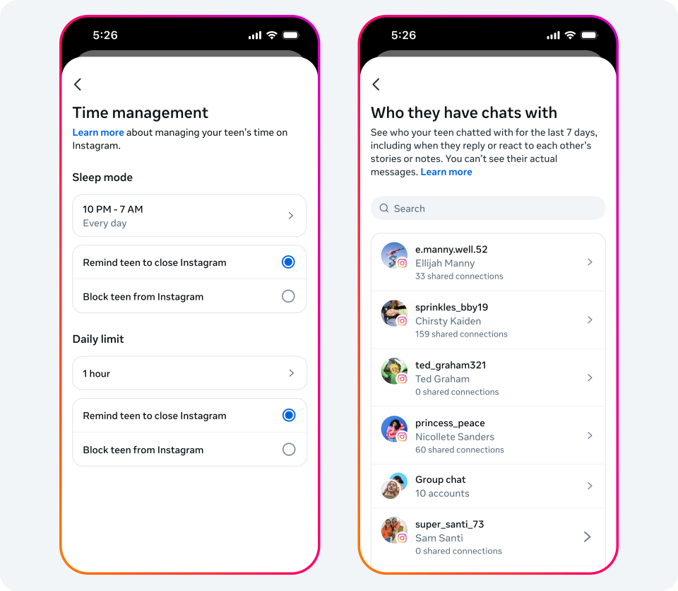
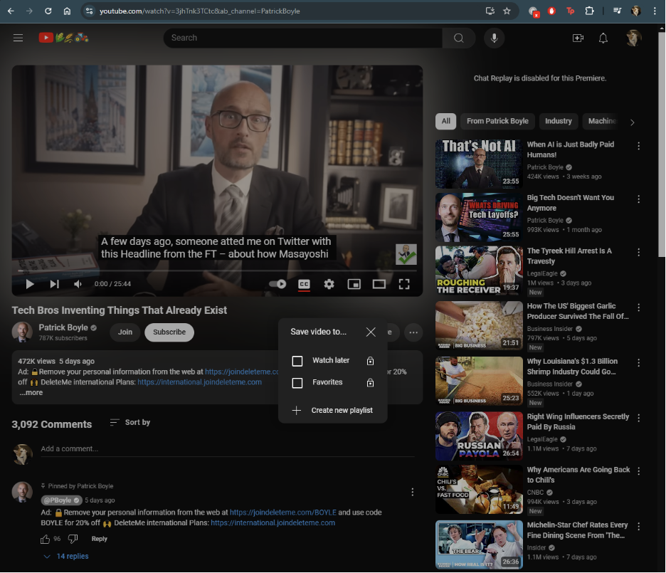
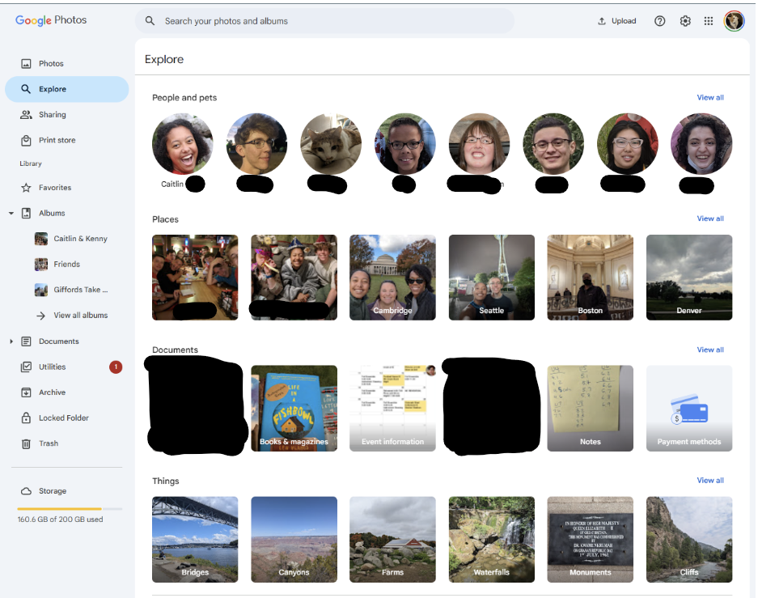
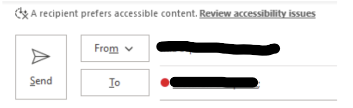
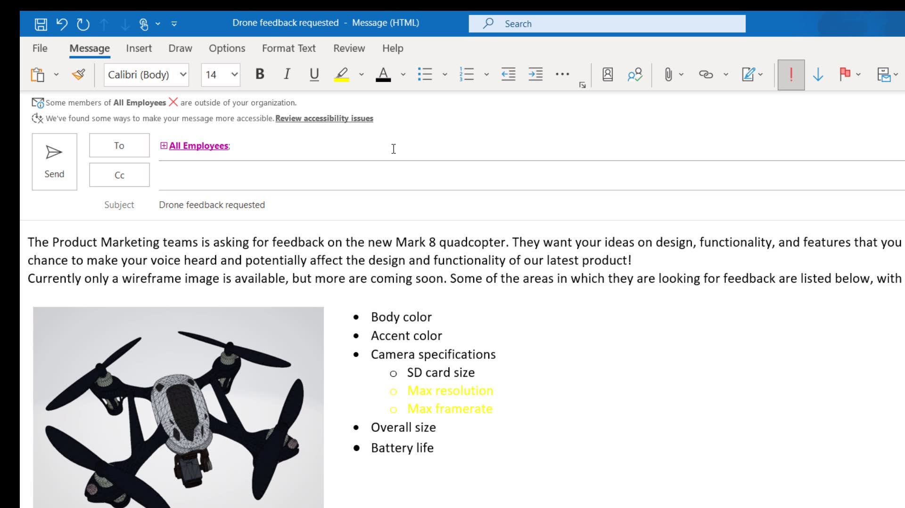
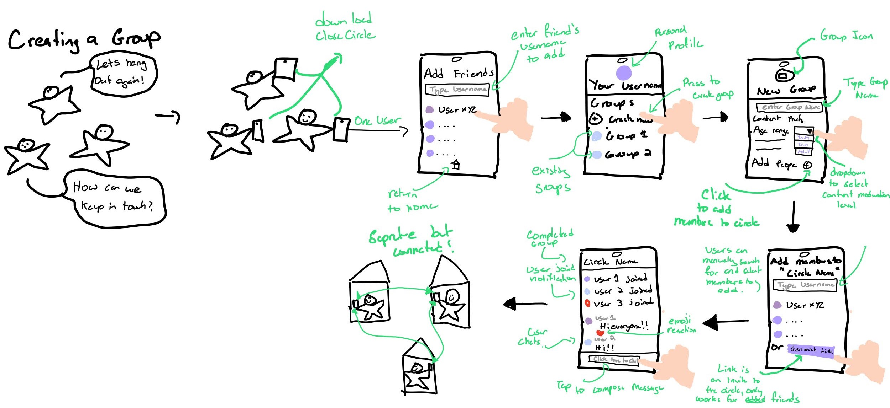
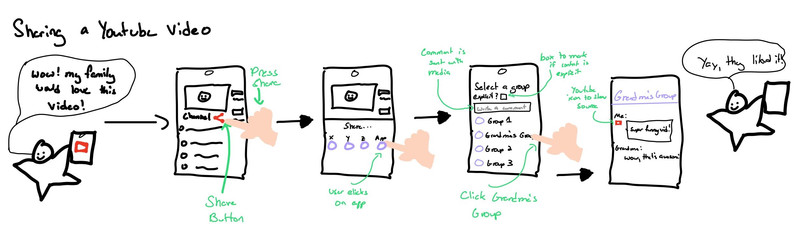

# Keep your friends close, and your circle closer

## CloseCircle

CloseCircle is a social media platform centered around your circles, empowering you to chat, share media from external sources, and keep your people up to date. CloseCircle is designed with *family* in mind, placing an emphasis on accessability and customizability, ensuring everyone you know can know what you're up to -- from your grandma to your second cousin, once removed.

## Comparables

| | |
| --- | --- |
| | |
| Instagram added new ["Teen" accounts](https://about.fb.com/news/2024/09/instagram-teen-accounts/) that are automatically private and have additional content moderation -- implementing a "child" profile in a similar way could help increase accessibility for children| Saving videos into different folders on YouTube -- could extend to sharing to “groups”/ albums |
|  | <video src="../images/maps-timeline.mp4" width="320" height="240" controls></video> |
| Visual organization of people and places in the Google Photos "Explore" page, with incorporated recommendations -- could inform the design of the landing page, also inspiration for "groups" and media organization. | History of all of your movements with places punctuated in Google Maps -- could be interesting to apply to your personal timeline, allow you to build a "story" about your day/trip/life |
| | |
|Outlook prompts you to fix any issues with accessibility it detects -- this could be implemented in theming, possibly in media sharing as well | Outlook allows users to choose a preference for accessible content, and it notifies others -- this could be an interesting way to allow users to assert their needs effortlessly|

## Possible Features

1. Personal Timeline
	- Users can populate a timeline, grabbing form places they've been, photos they've taken, and events they attended. This can be accessed by their close friends, and commented on/ reacted to.
2. Event invitations
	- Users can create events (virtual or in person), and invite others to join. Other users can RSVP and chat about the event.
3. Creating “Groups”
	- Central to the app, the user should be able to create, delete, leave, and join groups of other users as they see fit. Groups correspond with at least one chat.
4. Calendar/conflict sharing
	- Users can share their calendars with other users, so they know when they can contact others, see them, or otherwise. GCal, iCal, and Outlook Cal integration.
5. Media finder
	- Robust internal searching for Media, that can sort by date, who sent it, if you reacted, etc.
6. Text AI integration
	- available to users to “decode” or facilitate conversations with others. This should include things like grammar assistance and basic translation Similar to Meta AI’s text based integration.
7. Media Grouping
	- Share a piece of external media to a centralized location, shared with specific people, similar to Youtube’s video folders. Permissions could be managed in a similar way to the google suite, where the owner must explicitly share with others.
8. “Sticky” Media commenting
	- When media is added to a group, any comments on the media should follow it. For example, if I left a “we’re making this for christmas dinner!” comment on a piece of media, and then shared it, all users should be able to see that comment, and it will persist if that instance is shared outside of the group (Based on the privacy settings of the commenter)
9. Link-based group/circle sharing
	- Joining groups should simply use a link. Those given the link will be given access to the group. Links can expire at a set time or last indefinitely.
10. Child/Teen profiles
	- Parents should be able to make child/teen accounts for their children. These accounts would be automatically private, and would have a specified content maturity. Parents could monitor their children's' friends lists through their own portal.
11. Automatic/notified chat pruning
	- If a user has not opened, interacted with, or sent messages, the chat is added to a purging list, and the user is prompted to examine them from time to time. This should reduce inbox clutter.
12. Internal and External Profiles
	- Users can select a pseudonym for external interactions (new friends), but are prompted to select a relevant name for internal circles, similar to Discord Server nicknames. Having one easy name for adding others, but remaining identifiable by your inner circle will smooth out the experience, particularly for older uses 
13. Media embedding with source identification
	- When a user embeds media from another source, the app should visually report the source ( Twitter, Youtube, Reddit) so that users know where they will go before they click, without having to rely on the link for details.
14. Chat themes and visual modifications
	- Users should be allowed to customize their spaces with backgrounds, font colors, and others. This will allow users to differentiate between their spaces easily. In addition, it is important that these custom themes are run under a basic accessibility checker, and notifications are raised if a user within the group has an accessibility preference.
15. User Disability self identification
	- Users can add notices to their profile about specific accommodations they would prefer, similar to Outlook’s accessibility warning. These can include voice text preferences, or visual ones.
16. Annotating images
	- Users should have access to an “editing” screen when they publish a photo to a group that allows them to annotate and do other basic editing tasks. This would allow them to customize their image for a specific audience (ex. Circling the important step in a recipe)
17. Notification control
	- Allow users to control what people, groups, and messages types are able to send them notifications. For example, a user should be able to specify that adding new media does not 
18. Group based language moderation
	- Groups should be able to set different moderation/profanity limits based on their preferences. For example, users could receive a warning/be stopped from sending a message with profanity in it to their grandmother’s chat. 
19. Individual language moderation
	- Individuals should also be able to set their own profanity preferences, in a similar way to the group feature. Their setting should be shared with their added friends so that they have more control over the content of the messages they receive
20. Robust manual moderation
	- Users that are the owners of chats should have access to a log of people’s activity in the chat, including seeing previously deleted messages. This will allow them to maintain a fine grained control over their personal spaces. The users should also be able to mute, and remove users of groups they own at will.
21. Customizable reactions and emojis.
	- Users should be able to react to messages and media sent to their groups, and should be able to create their own, custom reactions tailored to their needs and inside jokes. 
22. Voice memo and transcription
	- Users should be able to record voice messages and send them within the app. Sent voice messages should be automatically transcribed to increase their accessibility.

#### Special thanks to Asal Vaghefzadeh! ♥

## VSD Analysis

1. <b>Indirect Stakeholders</b> - Managing External Content
	- If CloseCircle users share or remixed content from a user of an external platform, the original creator could lose attribution and have diminished recognition for their work, especially in tight-knit communities where the original creator might be obscure.
	- A system of persistent attribution tags could help ensure creators are credited, even when their content is modified or shared. Additionally, an attribution history feature could track content evolution, giving visibility to all contributors.

2.  <b>Variation in Human Ability</b> - Disability self-identification

	- A feature that relies on self-identification can be incredibly helpful, but it places the user in a vulnerable position, particularly if they do not feel comfortable sharing their disability with others
	- It may be best to restrict features like chat theme creation to prescribed, accessible options to reduce the burden on the person with a disability. Alternatively, it would be wise to have explicit permissions for who gets to see a user's accessibility preferences. Could work be done to auto-format based on a user's preference?

3. <b>Accounting for Culture</b> - Transcending Generational Barriers

	- In written communication, expectations on response type, length, and content can vary wildly between generational groups (The typical "." after a sentence divide comes to mind).
	- Emphasizing flexibility in communication styles is key. It would be incredibly interesting to have a "Generation" tag on a group chat, so that if you are in a mostly "Gen X" community, periods are auto-suggested at the end of your sentences, or "Boomer" chats encourage sending stickers/emojis as separate messages rather than use small reactions. It is important that a feature like this that imposes a style of conversation on others is toggle-able.

4. <b>Non-targeted Use</b> - Insular and Unsavory Communities

	- This platform emphasizes customization for all types of communities, but that flexibility could lead to the formation of insular or harmful groups.
	- Implementing community health indicators could help flag isolated or problematic spaces based on interaction patterns, content, and diversity of opinions. This would help prevent the platform from fostering echo chambers or supporting harmful behavior within closed groups. It could also be used in a positive way, with circles receiving additional custom emoji spots for participating in meaningful engagement with diverse content.

5. <b>Non-targeted Use</b> - Spam, Botting, and Phishing

	- In a platform that emphasizes closeness *and* targets less tech savvy users, there is a clear threat of social engineering and spam.
	- Users should be sternly directed, or even forced to not open media from new friends/connections. Users should also not be able to be added to groups by people they are not already friends with by default. It would also be best to have a robust user verification system. However, things like requiring a telephone number may be inherently exclusive for those who cannot access one.

## Story Boards

### Translating a New Friend Group to Cyberspace

[Click Here for Full Screen](../images/create-group.jpg)

### Sharing a YouTube Video with Family

[Click Here for Full Screen](../images/share-youtube.jpg)

