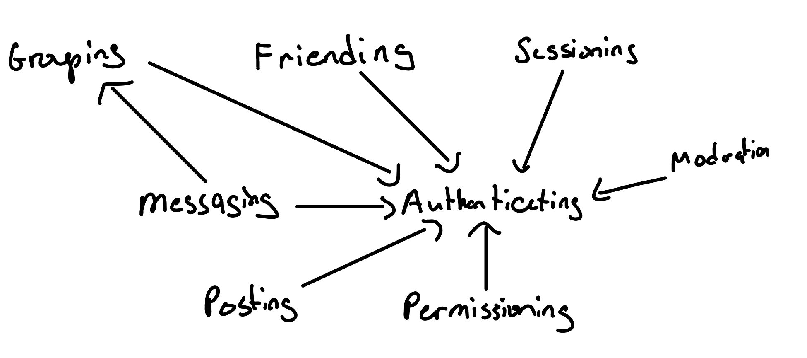

# Convergent Design

## Pitch

Grove is a social media app intended to help you grow and strength your connections to the important people in your life. In your Treehouse, you can post content like photos, vidieos, voice messages, or links to external media and display it proudly. You can choose who sees your cultivated crop of culture through Branches. Branches are groups of people that are organized by you. Perhaps a branch for your family, one for your study group, and one for your childhood best friends. 

item 
-  description. 

## Concepts

#### Concept: Session-ing [User]
Purpose:
allow users to act under their authenticated credentials for an extended period of time. 
Principle:
after a user begins a session, completed actions are associated with the user. 
State: 

active: <strong>set</strong> Session 
-  stores the current session. 
user: active → <strong>one</strong> User 
-  description. 

Actions: 

Start(user: User, <strong>out</strong> s: Session) 
- begins the user's session, stores the session in s 
getCurrentUser(s: Session, <strong>out</strong> user: User) 
- given the session, returns the current user. 
End(s: Session) 
- Concludes the session, no output. 

In Grove, sessions will serve a traditional purpose of allowing the user to have their actions associated with their authenticated credentials. In this way, when a user logs in, their session will persist until they end it by logging out.
***

#### Concept: Authenticating
Purpose: Authenticate a user so that an app user corresponds to a person  
Principle: after a user (u) is <strong>registered</strong>with a username (n) and password (p), they can authenticate themselves to the system by providing them:  
register (u, n, p); authenticate (u, n, p) {u' = u}  
State: 

Actions: 

***

#### Concept: Messaging [User]
Purpose: enable users to send, receive, and manage communications (text, audio, image, etc.) 
Principle: a user (sender: s) can create a message (m) to send to a recipient(s) (r), as well as receive a message from another user. A message received is identical to the message sent. 
sendMessage(s, m, r) → receiveMessage(s, m', r) {m' = m}  
State: 

history: <strong>set</strong> Conversation 
-  The set of all conversations that one user is a part of. 
message: history → <strong>one</strong> Message 
-  Any one conversation will send only one message at a time. 
sender: message → <strong>one</strong> User 
-  Any one message has exactly one user who sends it. 
recipient: message → <strong>one</strong> Group or User 
-  Any one message has either a single or group of users who receive it. 

Actions: 

sendMessage(sender: User, message: Message, out conversation: Conversation) 
-  send one message to a recipient.
-  add new message to conversation history. 
receiveMessage(conversation: Conversation, out message: Message) 
-  retrieve sent message. 
getMessageHistory(sender: User, recipient: User, out conversation: Conversation) 
-  given a user and a recipient, retrieve the entire conversation history. 
deleteMessage(sender: User, message: Message) 
-  given a user and a message, remove this message from conversation history. 

In Grove, users are able to communicate with others through messaging. They can send and receive messages from others, as well as send messages to groups that contain multiple users, known as branches in Grove.

***

#### Concept: Friending
Purpose: to allow users to establish connections with other trusted users in the app  
Principle: when a user sends a friend request to another, the recipient can choose to accept it or decline it. If a user accepts a friend request, a friendship is formed and they are added to each others' set of friends. 
State: 

friendships: <strong>set</strong> Friendship 
requester: Friendship → <strong>one</strong> User 
recipient: Friendship → <strong>one</strong> User 
status: Friendship → <strong>one</strong> Status 
-  The set of all conversations that one user is a part of. 

 
Actions: 

sendFriendRequest(requester, recipient: User, <strong>out</strong> friendship: Friendship) 
acceptFriendRequest(friendship: Friendship) 
declineFriendRequest(friendship: Friendship) 

 

In Grove, friending is paramount. It is through adding friends that you can grow a community to create branches with, or share content to. Users do not see content or receive messages from users that they are not friends with, and have the ability to remove friends at will. Only friends can be added to branches, though friends of friends can be added.

***

#### Concept: Permissioning [user, %<resource%>]
Purpose: allows a user to determine which users have access to different resources in their account with varying levels of access (view, edit, admin).  
Principle: when a user grants permission to another user for a resource they control, the other user can then view and modify that resource. If the permission is revoked, the grantee will no longer have access to the resource. 
State:  

permissions: <strong>set</strong> Permission 
grantor: Permission → <strong>one</strong> User 
grantee: Permission → <strong>one</strong> User 
resource: Permission → <strong>one</strong> Resource 
accessLevel: Permission → <strong>one</strong> AccessLevel 
-  ie view, edit, admin, etc.

 
Actions: 

grantPermission(grantor, grantee: User, resource: Resource, accessLevel: AccessLevel) 
revokePermission(grantor, grantee: User, permission: Permission) 
declineFriendRequest(grantee: User, resource: Resource, accessLevel: AccessLevel, <strong>out</strong> boolean) 

 

Permissioning takes a few different forms in Grove. In a traditional sense, it is the mechanism that determines which users are able to see the content you post, the comments you write on other's posts. Permissions also govern the Parent → Child account relationship, where Parent accounts are given varuying levels of permission to the Child's account, depending on parameters chosen during account setup. For example, a parent would have permission to view and edit a connected Child account's friend list.

***

#### Concept: Posting
Purpose: allow a user to create and share content with other users.  
Principle:after drafting content, the user can post it, making it available to other users. The author may delete or modify the content of the post after posting. 
State: 

posts: <strong>set</strong> Post 
author: Post → <strong>one</strong> User 
content: Post → <strong>one</strong> Content 

 
Actions: 

createPost(author: User, content: Content, <strong>out</strong> post: Post) 
editPost(author: User, post: Post, newContent: Content) 
deletePost(author: User, post: Post,) 

 

Users are able to post to their Treehouse, with messages, images, links, and more. In Grove, the visibility of the post is dependant on the Branches that the user allows to view it. Friends are not automatically allowed to see posts unless they are a part of a permissioned Branch. 
***

<!-- #### Concept: Grouping
Purpose:  
Principle: 
State:  
Actions:  -->

# Dependency Diagram

  

# <a href="https://www.figma.com/proto/cAL4lAT50quuSz89dGe6eb/A3-Wireframes?page-id=0%3A1&node-id=23-9&node-type=canvas&viewport=-675%2C208%2C1.32&t=o0afcttdZjBoLatM-1&scaling=min-zoom&content-scaling=fixed&starting-point-node-id=23%3A9&share=1&show-proto-sidebar=1"> Wireframes </a>

# Design Tradeoffs

## Handling Branches

In Grove, users can only see each other's content when they are in a permissioned branch, not necessarily just due to their connection. Typically, friends are the base level unit on social media apps. When a friendship is created, both users are automatically "permissioned" view to the content posted by the other. For grove, I decided that I wanted to keep the emphasis on these branches that you form. To incentivize it's use, I implemented the branch only posting system. Users can still send content to their friends via direct message. It will be important for me to readily surface who is in what branch to the user, to avoid confusion and frustration when navigating the system.

